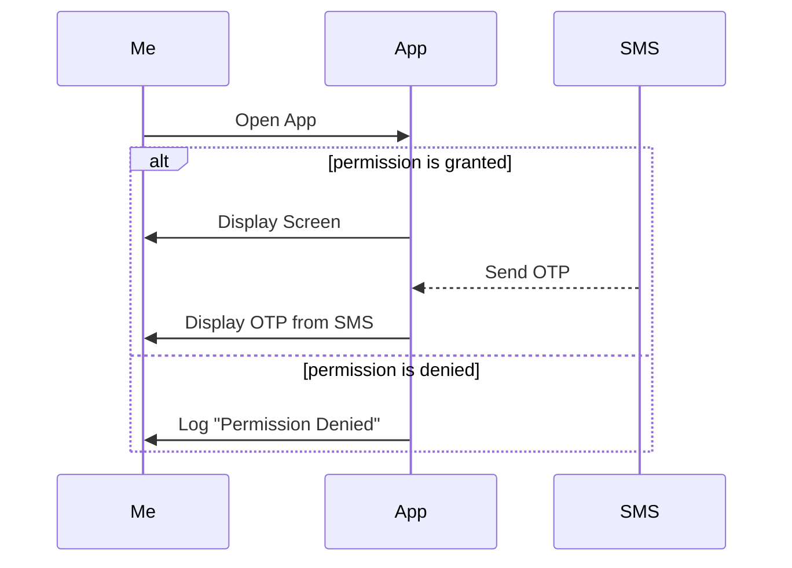

# NopyJF Broadcast Receiver

Hello! I'm NopyJF from home. In evening of someday, I use some app in my mobile phone and I found an app that  **send OTP from SMS and an app fill code automatically**. So I wanna know how does it work! that make me to do this project. So I try to designed this app that like OTP screen, There is text field to received data from SMS.

## Layout

In this project, I used **Jetpack Compose** because It's quick to draw layout and I wanna learn something new.

## Broadcast Receiver

For this, I try to set this class in AndroidManifest.xml but I have some function type for listen OTP data. It's be better **I call broadcast receiver in activity instead from AndroidManifest.xml file**.

## Permission

I used **Result API** for request permission.

## Diagram
